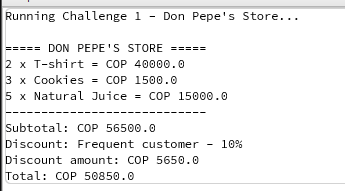
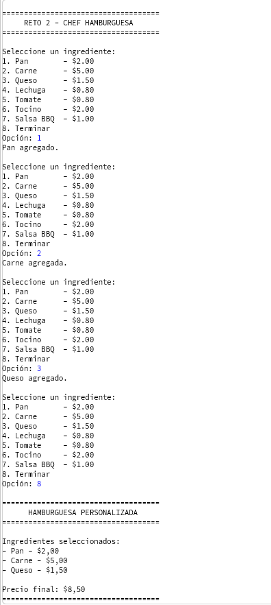
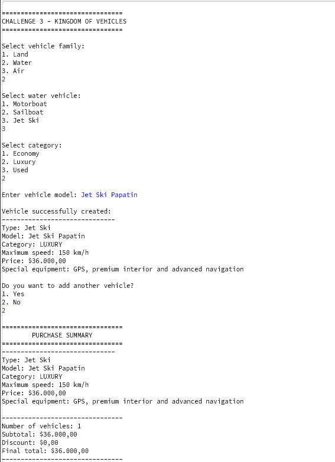
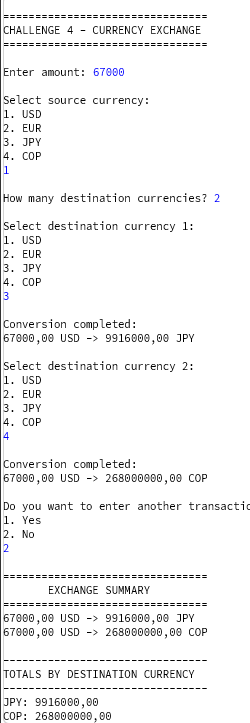
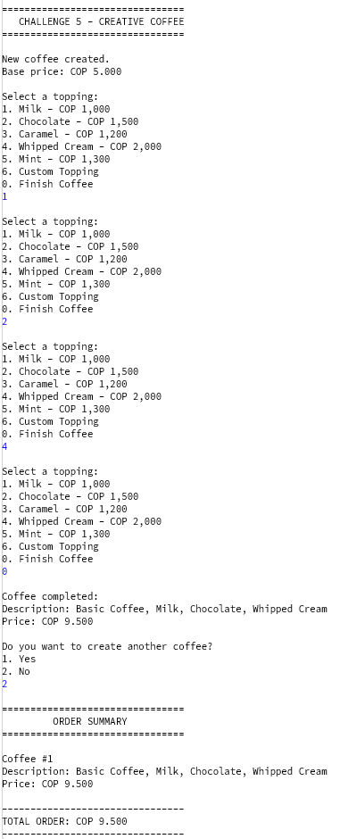
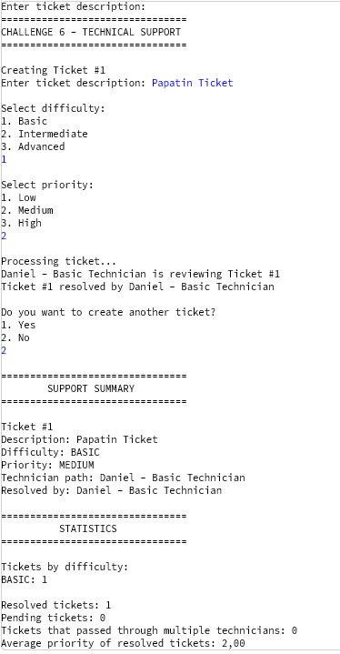
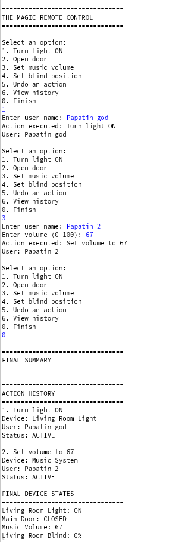
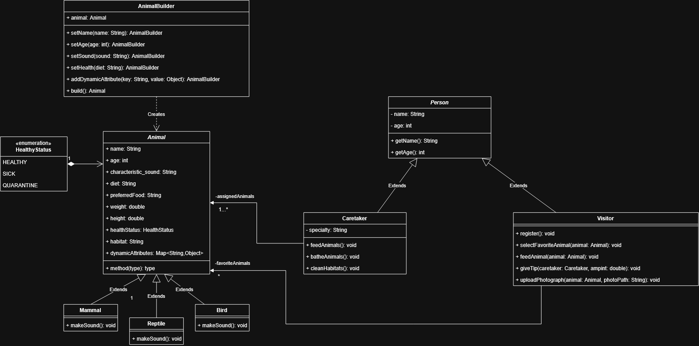
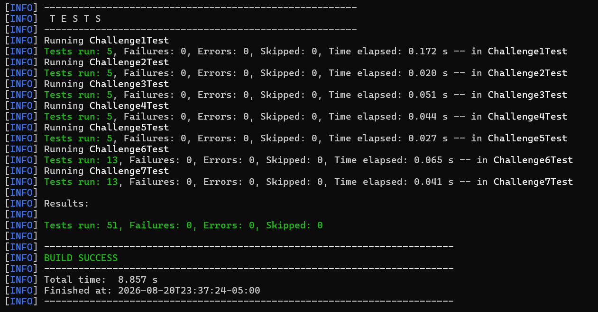

# DOSW\_Lab2\_Ibanez\_Sanchez\_Vega

# Challenge 1 — Don Pepe's Store

## SOLID Principles

| Principle | Application in the Solution |
|---|---|
| Single Responsibility | Each class has a specific responsibility. Products store their information, the cart manages the purchase, and discount classes calculate the corresponding discount |
| Open/Closed | New types of discounts can be added without modifying the existing discount logic |
| Liskov Substitution | Any discount implementation can be used in place of another as long as it follows the same discount contract |
| Interface Segregation | The interfaces contain only the methods that their implementations actually need |
| Dependency Inversion | The purchase logic depends on the discount abstraction instead of a specific discount class |

## Polymorphism

Polymorphism is used through the discount interface, different discount implementations can be used through the same contract, allowing the program to apply different behaviors depending on the customer type

## Encapsulation and Immutability

The attributes are private and are accessed through the methods provided by each class, product prices are immutable because they are declared as final and can only be assigned when the product is created

Java Streams are used to process the products and calculate totals using operations such as `map`, `filter`, `reduce` and `forEach`

# Challenge 2 — The Five-Star Chef

## Design Pattern Documentation

| Item | Team Explanation |
|---|---|
| Design Pattern Category | Creational |
| Pattern Used | Builder |
| Justification | A hamburger is created step by step and can have different combinations of ingredients, builder makes this construction easier without needing different constructors for every possible combination |
| How It Was Applied | A builder receives the ingredients selected by the user and builds the final hamburger, streams are used to calculate the price of the selected ingredients |

# Challenge 3 — The Kingdom of Vehicles

## Design Pattern Documentation

| Item | Team Explanation |
|---|---|
| Design Pattern Category | Creational / Behavioral |
| Pattern Used | Abstract Factory / Strategy |
| Justification | Abstract Factory helps organize the creation of the three vehicle families, strategy separates the discount calculation from the rest of the purchase logic |
| How It Was Applied | Separate factories create land, water and air vehicles, a discount strategy calculates the discount according to the number of vehicles selected |

The vehicle category also affects its price, maximum speed and equipment, Java Streams are used to add the prices of all selected vehicles

## Discount Rules

The discount rules used in our implementation are:

- 1 vehicle: no discount.

- 2 vehicles: 5% discount.

- 3 or more vehicles: 10% discount.

# Challenge 4 — The Currency Exchange Scam

## Design Pattern Documentation

| Item | Team Explanation |
|---|---|
| Design Pattern Category | Behavioral |
| Pattern Used | Strategy |
| Justification | The conversion logic is separated from the main service, making it possible to change how currencies are converted without modifying the service |
| How It Was Applied | The conversion strategy receives the source and destination currencies and obtains the corresponding rate from an exchange rate provider |

## Exchange Rates

Exchange rates are stored separately for each currency pair. For example, USD to COP has a different rate from USD to EUR

The exchange rate provider receives the source and destination currencies and returns the rate that corresponds to that specific pair. This prevents the system from using the same exchange rate for every conversion

Java Streams are used when converted amounts from multiple transactions need to be grouped or accumulated

# Challenge 5 — Customized Coffee

## Design Pattern Documentation

| Item | Team Explanation |
|---|---|
| Design Pattern Category | Structural |
| Pattern Used | Decorator |
| Justification | Decorator allows toppings to be added to a coffee without modifying the base coffee class, it also allows several toppings to be combined |
| How It Was Applied | Each topping works as a decorator that wraps a coffee and adds its own description and Price, new toppings can be created without changing the base coffee |

Java Streams are used to calculate the total price of the coffees created during the execution

# Challenge 6 — Talk to Technical Support

## Design Pattern Documentation

| Item | Team Explanation |
|---|---|
| Design Pattern Category | Behavioral |
| Pattern Used | Chain of Responsibility |
| Justification | A ticket can pass through different technicians until one of them has the required level and priority to resolve it. |
| How It Was Applied | Each technician checks whether they can resolve the ticket. If not, the ticket is passed to the next technician in the chain. If nobody can resolve it, it remains pending escalation. |

Java Streams are used to obtain statistics such as tickets by level, resolved tickets, pending tickets and the average priority of resolved tickets

# Challenge 7 — The Magic Remote Control

## Design Pattern Documentation

| Item | Team Explanation |
|---|---|
| Design Pattern Category | Behavioral |
| Pattern Used | Command |
| Justification | Command allows each remote control action to be represented independently, making it possible to execute, store and undo actions |
| How It Was Applied | Each action is represented by a command with 'execute' and 'undo' operations. The remote executes the commands and keeps a history with the action and the user responsible for it |

The history is kept even when an action is undone. This makes it possible to know who executed each action, which actions were undone and who modified each device

# Challenge 8 — The UML Zoo

## Main Classes and Responsibilities

| Class or Interface | Responsibility |
|---|---|
| AnimalBuilder | Implements the Builder pattern to create and configure animal instances step by step |
| Animal | Contains the common information and behavior of zoo animals |
| HealthyStatus | Enumeration representing the health states of an animal (HEALTHY, SICK, QUARANTINE) |
| Mammal | Represents mammals in the zoo |
| Reptile | Represents reptiles in the zoo |
| Bird | Represents birds in the zoo |
| Person | Base class representing people (caretakers and visitors) in the system |
| Caretaker | Represents the person responsible for feeding, bathing and cleaning habitats for animals |
| Visitor | Represents visitors, their interactions, and tracking of favorite animals |

## Relationships

| Source | Relationship | Target | Multiplicity | Explanation |
|---|---|---|---|---|
| Mammal | Inheritance | Animal | 1 | Mammal inherits from Animal |
| Reptile | Inheritance | Animal | 1 | Reptile inherits from Animal |
| Bird | Inheritance | Animal | 1 | Bird inherits from Animal |
| Caretaker | Inheritance | Person | 1 | Caretaker inherits attributes and methods from Person |
| Visitor | Inheritance | Person | 1 | Visitor inherits attributes and methods from Person |
| AnimalBuilder | Dependency | Animal | - | AnimalBuilder creates and returns Animal instances |
| Animal | Composition | HealthyStatus | 1 | An animal is strictly composed of one health status |
| Caretaker | Association | Animal | 1..* | A caretaker is assigned to manage and care for one or more animals |
| Visitor | Association | Animal | * | Visitors can select and track several animals as favorites |

## SOLID Application

| Principle | Application in the UML Design |
|---|---|
| Single Responsibility | Each class represents a specific part of the zoo system, such as animals, visitors, caretakers or habitats |
| Open/Closed | New animal types or attributes can be added without changing the existing classes |
| Liskov Substitution | Mammals, reptiles and birds can be treated as Animals without changing the expected behavior |
| Interface Segregation | Classes only depend on the operations that they need |
| Dependency Inversion | The design uses general abstractions such as Animal instead of depending only on specific animal types |

## Design Patterns

| Item | Team Explanation |
|---|---|
| Design Pattern Category | Creational |
| Pattern Used | Builder |
| Justification | Animal creation is handled step by step using a builder to handle multiple attributes and health statuses cleanly |
| How It Was Applied | The AnimalBuilder class constructs the animal instance progressively before returning the final object |

## UML Class Diagram

# Testing

These values must be completed with the real results obtained after running:

`mvn test`

# Team Members

| Name | GitHub Username | Main Contributions |
|---|---|---|
| Yazid Alejandro Sánchez | Yalixsan | Implementation of assigned challenges, tests and code integration. |
| Sergio Andrés Vega | Zixer | Implementation of assigned challenges, documentation and tests. |
| Daniel Santiago Ibañez | Elpit_osdude | Implementation of assigned challenges, design patterns and tests. |
